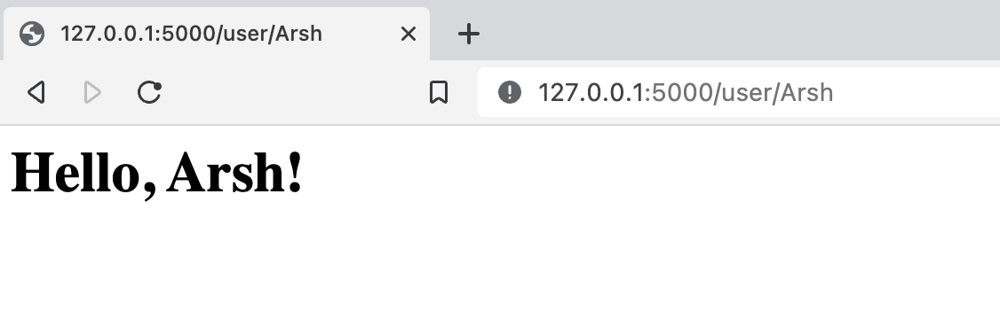

## ECE444-F2022-Lab2

My name is Arsh Kadakia, and this repo is a clone of 
https://github.com/miguelgrinberg/flasky.

**Activity 1: Installation**

**Activity 2: Creating repo and Example 2**

Commit message for reproduction of example 2-1: "code for example 2-1"

Hash: 4119b3e

Commit message for reproduction of example 2-2: "code for example 2-2"

Hash: 92a0445

**Activity 3: Replay and modify Example 3**

Commit message for completion of Activity 3: "added code for example 3"

Hash: a92e554

**Activity 4: Replay and modify Example 4**
Commit message for reproduction of Example 4-7: "reproduced example 4-7"

Hash: 7db387c

Commit message for Steps 2-5 of Activity 4: "completed section 4 code"

Hash: 6a50bf4

